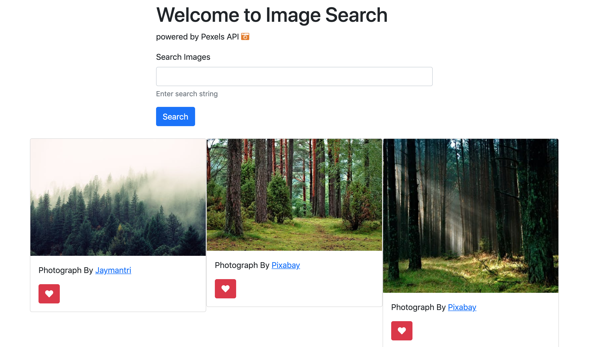
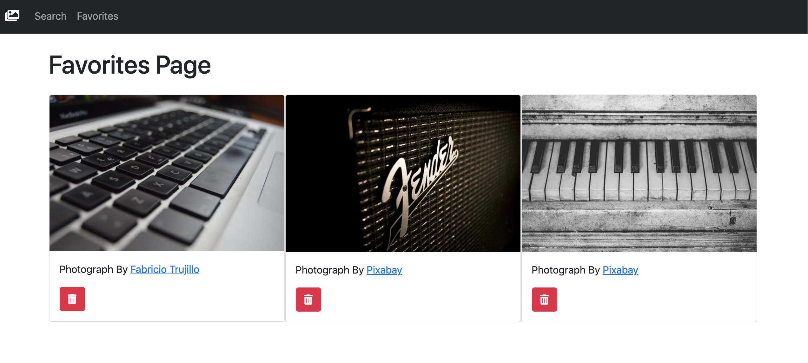

# Project: Node Image Search

### Live Application : [Image Search](https://blooming-scrubland-70778.herokuapp.com/)

&nbsp;

## Description:

Simple image search application that displays a series of photographs along with the name of the photographer that submitted them. Application utilizes a Node/Express backend and displays requested data with the aid of the Handlebars template view engine. Image data is retrieved using the Pexels third party developer API. 

&nbsp;

## Technologies:

- JavaScript
- Bootstrap CSS
- Node / Express
- Handlebars
- MySQL Database
- Sequelize ORM
- Utilizes third party API data (Pexels API)

&nbsp;

## Usage:

User can enter a search term into the form input and hit submit. User will then be presented with a series of images based on their request input.

&nbsp;


#

#



&nbsp;

## Instructions:


To run the project locally start by cloning the project repository. [Clone Image Search](https://github.com/ehoversten/image_search.git)

Change directory into the saved project directory then in your terminal run the following:

```javascript
npm install
```

Make sure that you create a MySQL locally on your machine. Open your favorite SQL database tool and create the database:
```SQL
CREATE DATABASE image_favorites;
```

Open the application code in your favorite text editor and update the `config.json` file to your machines specifications:
```json

"development": {
    "username": "<YOUR_MACHINE_USERNAME>",
    "password": "<YOUR_MACHINE_PASSWORD>",
    "database": "image_favorites",  // <-- If you called your DATABASE something else update it here!
    "host": "127.0.0.1",
    "dialect": "mysql",
    "operatorsAliases": false
}

```

Once the project dependencies are installed, and the database settings are configured, start the program by running:

```javascript
npm run start
```

&nbsp;

Open your favorite web browser and navigate to http://localhost:3000/

&nbsp;

## Maintainer

- Erik Hoversten

&nbsp;

## License:

Licensed under the MIT license.
