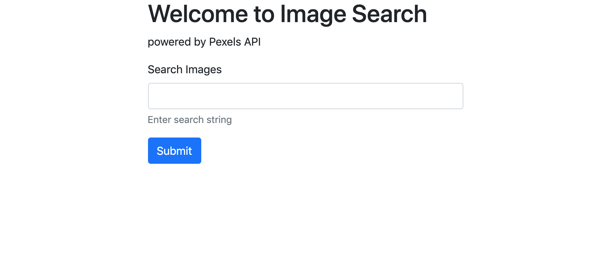

# Project: Node Image Search

&nbsp;

## Description:

Simple image search application that displays a series of photographs along with the name of the photographer that submitted them. Application utilizes a Node/Express backend and displays requested data with the aid of the Handlebars template view engine. Image data is retrieved using the Pexels third party developer API. 

&nbsp;

## Technologies:

- JavaScript
- Bootstrap CSS
- Node / Express
- Handlebars
- Utilizes third party API data

&nbsp;

## Usage:

User can enter a search term into the form input and hit submit. User will then be presented with a series of images based on their request input.

&nbsp;




&nbsp;

## Instructions:


Clone the project repo.

Change directory into the saved project directory then in your terminal run the following:

```javascript
npm install
```

Once the project dependencies are installed, start the program by running:

```javascript
npm run start
```

&nbsp;

To try out the application functionality follow the link: http://#

&nbsp;

## Maintainer

- Erik Hoversten

&nbsp;

## License:

Licensed under the MIT license.
